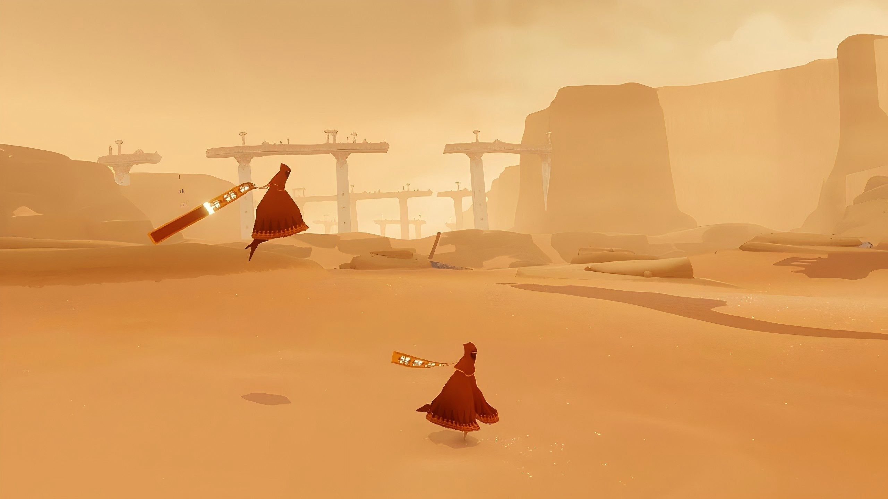
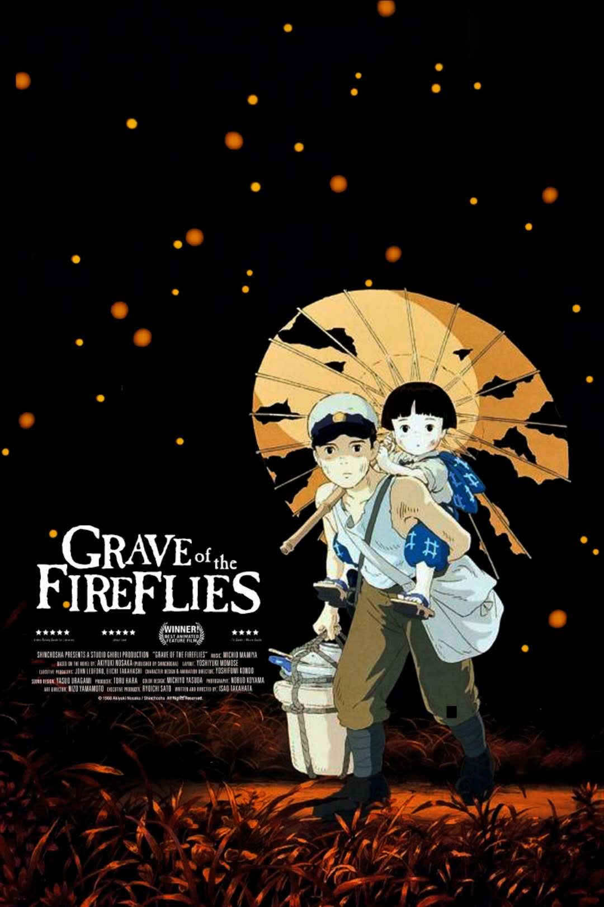

# quiz10_Carlos_Shumin_Group03

## Part 1: Project Direction

Our project, Firefly Catcher, is an original interactive artwork. One inspiration comes from Journey, where players connect with the environment through movement and sound, and the experience focuses more on rhythm and emotion than complex controls. The visual inspiration comes from the floating lights in Grave of the Fireflies. 

*Inspiration 1: Journey*

*Inspiration 2: Grave of the Fireflies*

The left side of the screen contains cool-colored fireflies in blue and purple tones, while the right side contains warm-colored fireflies in red and orange tones. We use Perlin noise and randomness to create natural and unpredictable movement. Players use low or high-pitched sounds to calm different groups of fireflies and make them hover. They then catch them through careful mouse movement and double-clicking. Each refresh generates a random catching mission. If players complete the task within 60 seconds, all fireflies celebrate by flying happily; otherwise, the screen slowly fades to black and restarts. 

---

## Part 2: Mechanics

### Audio Mechanic (Owned by Hongxiao He)
The audio mechanic uses the microphone to detect the pitch of the player’s voice. This is the main “magic” system in our game. When the player makes a low sound, the system detects low-frequency audio and causes the cool-colored fireflies on the left side of the screen to slowly stop moving. In the same way, when the player makes a high-pitched sound, the warm-colored fireflies on the right side begin to slow down and hover in place. Each firefly slows at a slightly different speed through randomness, making their behavior feel more natural and alive. The player feels like a real wizard using different voice tones as magic spells. This mechanic matches our vision of controlling the environment through sound and creates a strong connection between the player and the fireflies. It also provides an interesting foundation for further interaction and makes the whole experience feel more immersive and playful. 

### Time-based Mechanic (Owned by Xinyang Yu)
The time mechanism controls the overall flow and difficulty of the game. Each time the page refreshes, the system generates a new random capture task, such as collecting a certain number of cool-colored or warm-colored fireflies before a countdown ends. The countdown creates tension, prompting players to make quick decisions during gameplay. As time progresses, the number and flight speed of the fireflies change, increasing the difficulty of capture and further enhancing the tension and excitement, thus stimulating player interest. In our game, time is also considered a resource. Players can gain an extra five seconds or other random abilities by successfully capturing a randomly appearing golden firefly. This mechanism adds rhythm and emotional variation to the gameplay experience, allowing players to switch between calm observation and sudden urgency, while also reflecting the unpredictable nature of fireflies. 

### Perlin Noise and Randomness (Owned by ruiyang sun)
We use both Perlin noise and random values to make the world feel alive and dynamic. Pure randomness is used in many gameplay rules. It decides how quickly each firefly slows down after reacting to the player’s voice, generates the catching mission at the start of the game, and controls when and where the special golden fireflies appear. At the same time, we use Perlin noise to control the flying paths of the fireflies. Perlin noise allows them to move in smooth and natural curves instead of straight lines or chaotic jumps. This makes their behavior feel more realistic and organic. Combined with the cool-colored fireflies on the left side and the warm-colored fireflies on the right side, the environment becomes visually rich, unpredictable, and full of life. The mechanic supports our vision of creating a magical nighttime world that feels natural rather than mechanical. 

### User Input Mechanic (Owned by Yurui Li)
The user input mechanic is based on mouse movement and timing. The player’s cursor becomes a catching net used to capture fireflies. However, catching them is not simple. If the player moves the mouse too quickly, nearby fireflies become frightened and fly away faster. If the player moves too slowly, the fireflies also notice the net and escape. Players must move the mouse at a steady speed, carefully approach the hovering fireflies, and then quickly double-click to catch them. This mechanic encourages patience and precision instead of random clicking. It supports our project vision by making the player feel like they are carefully interacting with living creatures. The movement of the hand becomes part of the gameplay rhythm and creates tension between calmness and control. 

---

## Part 3: Putting It Together

All the mechanics work together on a screen with contrasting warm and cool color tones. Peripheral noise creates a natural, dynamic effect for the fireflies, while player voice commands influence their behavior. Mouse input controls the catching of the fireflies, and a time-based mechanism alters the overall pace of the game. Randomly appearing golden fireflies link time to player interaction, while changes in the speed and number of fireflies ultimately link time to movement, intensifying the tension. All these effects combine to create a tense and engaging interactive mini-game.
